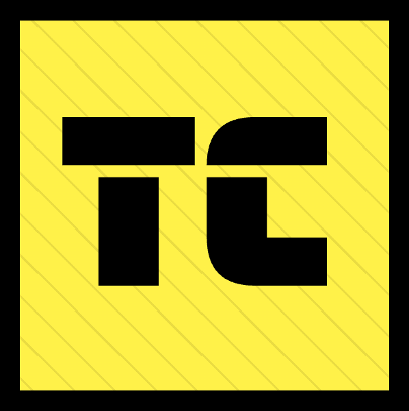

Type-C Official Website
===

## About:
This repository hosts Type-C website source code. Since blog posts and documentations are hosted on the same app, this app is configured to work very similarly to (nextra)[https://nextra.site/docs], except it is custom made for my needs.

Documentation and Blog articles are written as MDX and each in its own repo, but added here are submodules.

This app itself is using Next.js, TailwindCSS, and MDX.